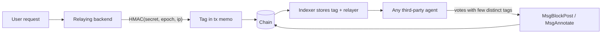

# Next feature: epoch-scoped network tags for relayed transactions

**Status:** Draft design, not implemented
**Date:** 2026-08-16
**Related:** `docs/agents/agent-overview.md`, `web/backend/client_ip.py`, `web/backend/tx.py`

## Problem

Vote-collusion farms are currently invisible to moderation agents. An agent sees
posts and votes on chain, but nothing about the network the actor came from, so
forty upvotes from one person's forty sock puppets look identical to forty
upvotes from forty people.

The backend already sees the client IP on every relayed action. The goal is to
publish a pseudonymous form of it that lets **any** agent — not just ones the
operator runs — cluster accounts that act from the same network, without
publishing a de-anonymizing phone book of users' IP addresses.

## Design

Each relaying backend computes, per transaction:

```
tag = HMAC-SHA256(SECRET, canonical("nettag:v1", iso_year, iso_week, family, ip))[:16 bytes]
```

- **`SECRET`** — 32 random bytes, one per **trust domain**, not one per server and
  not one globally. The four official nodes share a single value so a tag matches
  whichever official frontend the user hits; any independent operator running a
  node generates their own and never receives ours. Never published, never
  committed, never given to an agent.
- **`iso_year` / `iso_week`** — both from the same `datetime.isocalendar()` call
  in UTC. Pairing a calendar year with an ISO week is a bug: late December can be
  ISO week 1 of the following year.
- **`family`** — `v4` or `v6`, also published in the memo so an agent can treat an
  IPv6 `/64` tag differently from an IPv4 tag affected by CGNAT.
- **`ip`** — the output of `get_trusted_client_ip()`: exact IPv4, or IPv6 bucketed
  to `/64`.
- **`canonical(...)`** — an unambiguous fixed binary encoding, not string
  concatenation: domain-separation bytes, two-byte ISO year, one-byte ISO week,
  one-byte address family, and packed IP/network bytes.

The tag is written by the relaying node into the **outer transaction memo**, and
the indexer stores parsed metadata on the transaction index, joinable to actions
by transaction hash and attributable through the existing `relayer` fields.
Agents read it off the chain like any other public field. The memo is a strict
ASCII protocol, not free text:

```
nettag:v1;n=<base64url namespace>;e=<ISO year>-W<ISO week>;f=<4|6>;t=<base64url tag>
```

The namespace and tag are unpadded base64url encodings of 8 and 16 bytes
respectively. The complete memo is well below the 256-character protocol limit.

Because keys are per trust domain, a tag is only comparable with tags from the
same domain. The node therefore publishes a **namespace** next to the tag:

```
namespace = HMAC-SHA256(SECRET, "nettag-namespace:v1")[:8 bytes]
```

Honest nodes sharing a key emit the same namespace automatically; independent
operators emit different ones. It is stable across epochs and safe to publish.
It is **not proof of domain membership**: a malicious relay can copy any public
namespace. The outer signature identifies the relayer that made the claim, and
agents must only compare tags across relayers they trust as members of that
namespace. For the official domain, that means the known official relay
addresses. A signed domain-membership mechanism can be added later if independent
multi-node domains need automatic discovery.

Network classification (`vpn | hosting | cellular | isp`) is **not part of v1**.
The existing free Team Cymru lookup is an external network call. It cannot both
run asynchronously and appear in a transaction that has already been signed, and
putting it on the posting path would add an unacceptable availability and latency
dependency. Revisit only with a free local ASN database that supports synchronous
in-process lookups. Even then, ASN/org keywords cannot reliably detect residential
proxies or distinguish a home line from a business line.



Detection is then a join an agent can run itself: for the voters on a post,
count distinct tags against total votes, scoped to comparable trusted relayers.
Forty votes and two tags is a strong collusion signal, combined with vote timing,
account age and graph behavior rather than treated as proof by itself.

## Reasoning

**Why a keyed MAC and not a salted hash.** IPv4 has only 2^32 values. Any
publicly evaluable function of an IP address is invertible by enumeration in
minutes; a published salt is equivalent to publishing the address. A secret key
removes the ability to evaluate the function at all, so a tag for a network the
attacker cannot reach stays opaque.

**Why the key's scope is a trust domain.** The unit is neither one key per server
nor one key for the network. **A key may be shared exactly as far as the set of
parties already trusted with the raw client IPs, and no further.** Whoever holds
it can evaluate the HMAC offline over the entire IPv4 space and reconstruct the
phone book the secret exists to prevent — including for users of *other* nodes in
the same domain, whose tags they could then resolve. Inside the official fleet
that costs nothing, since all four nodes are one operator who already sees those
IPs. Handing the key to an independent operator would hand them deanonymization
of every official-frontend user, so they generate their own instead.

Splitting keys *within* the fleet, by contrast, buys no privacy and costs
detection. A farm spread across four official frontends would fragment into four
unrelated clusters even though all four servers have the same operator and trust
boundary.

The trade this accepts: a farm that splits itself across the official fleet and
an independent node is only partly visible, because those tags live in different
domains and cannot be compared by anyone. Cross-domain joining would require the
threshold-OPRF construction discussed below, not key sharing.

**Why the epoch is in the HMAC input rather than rotating the secret.** Same
privacy property, no operational ceremony: nothing to distribute every period, no
window where nodes disagree, and all four derive the same epoch by construction.
The secret holder retains the ability to recompute a past epoch for forensics;
the public does not.

**Why weekly.** Farms raid in hours, so a weekly window costs almost no detection
power, while capping how much linkage history accumulates in public. Daily would
be more private and still catch most raids; weekly is the safer default for
slower farms.

**Why on chain rather than in the backend database.** Agents are permissionless
by design — anyone can write one, and the platform's value proposition is that
AntiSpamBot is an example of a pattern, not a privileged operator tool. Keeping
tags in operator-owned Postgres would make the operator the sole producer of
farm detection and force every other agent to trust their aggregates.

**Why the memo, not a proto field.** The relayer signs the entire `TxBody`, so a
memo tag is an *attributable* claim: everyone knows which relay asserted it, and
a relay that writes garbage is blockable by its address. That needs no proto
change, no upgrade handler, and no consensus-breaking release. Consensus never
has to verify the tag's correctness, only carry it.

This is also the best fit for the current repository rather than merely the
shortest implementation:

- All 26 backend relay paths currently build a one-message `TxBody` with an empty
  memo.
- The indexer already decodes the complete `TxBody`.
- The local chain reports `max_memo_characters=256`; this protocol uses less than
  half of that.
- A typed `non_critical_extension_options` payload is cleaner in the abstract,
  but Cosmos resolves the contained `Any`. Every validator would have to register
  the new type before tagged transactions appeared, requiring a coordinated
  upgrade for no additional trust.

Memo metadata is transaction-scoped. That matches the official backend, where
one HTTP relay request produces one message and one transaction. If a future
relay batches independent client requests into one transaction, one memo can no
longer represent every source; that relay must either stop cross-source batching
or the protocol must move to indexed per-message metadata.

**Why relay identity needs no new work.** The outer transaction is signed by the
relaying node, and the indexer has stored `relayer` on posts, votes and awards
since `v1.18.0` (`indexer/database.py:147`). A hostile relay stamping fake tags
identifies itself on every transaction it relays, so blocking everything from
that relayer is already possible today.

## Rebuttals

Objections raised during design, and where each landed. Recorded so they are not
re-litigated from scratch.

| Objection | Outcome |
| :--- | :--- |
| "Just publish `sha256(salt + ip)`" | **Rejected.** 2^32 IPv4 addresses; a public salt makes the hash equivalent to the address. |
| "Rotate the salt daily to stop brute force" | **Rejected as a fix for that problem.** Either the salt is secret (rotation unnecessary for enumeration) or public (rotation does not help). Rotation is a blast-radius control, not an anti-enumeration one. |
| "A farm using 10 different relays defeats node-local tags" | **Correct, and it drove the design.** Answered within a trust domain by the shared fleet secret plus on-chain publication; tags join across the four official frontends. A farm running its *own* relay can publish arbitrary or absent metadata, but every claim remains attributable to its unforgeable relayer address, which agents can score or block independently. |
| "Direct-RPC submission bypasses the frontend, so the field is worthless" | **Wrong, and withdrawn.** The relayer signs the outer transaction, so relay identity is unforgeable and a spam relay is blockable. Direct-RPC transactions simply carry no tag; absence must be read as *unknown*, never as *clean*. |
| "This must be a change to the message / proto" | **No.** The memo is part of the signed `TxBody`. No proto, no upgrade handler, no consensus break. |
| "Off-chain storage means only the operator can use it" | **Correct criticism.** Third-party agents are the point; that is why the tag is published on chain rather than kept in `mirage_backend`. |
| "A secret key makes the tag irreversible, so there is no privacy cost" | **Mostly correct for IP secrecy.** A public tag cannot be reversed or enumerated without the key. A user who already has access to a network can submit one transaction from it and compare the resulting current-week tag with other transactions; this reveals only same-network equality, never the IP. That narrow property is inherent in the feature and is not a blocker. The weekly epoch prevents passive construction of one permanent all-time linkage graph. |
| "Hide a random 16-bit modulator each week" | **Rejected.** `HMAC(secret, public_week, IP)` already produces independent weekly outputs; knowing one week does not help compute the next. A hidden value does not stop a new request from obtaining the current tag, and 16 bits can be brute-forced after a key compromise. A forward-secure 256-bit key ratchet would protect old epochs after a later compromise, but adds synchronization and key-erasure complexity and is not proposed for v1. |
| "Farms rotate IPs while honest users don't, so it punishes the wrong people" | **Largely answered by the epoch.** The permanent public cost to honest users disappears once tags expire weekly. What remains — an imperfect signal — is true of rate limits and PoW too, and is an argument about how an agent weights it, not about collecting it. |
| "CGNAT means unrelated users share a tag" | **Real, and mitigated rather than solved.** See below. |
| "Why not just use IPv6 and dodge CGNAT?" | **Already happening where possible.** See below. |
| "Use a typed transaction extension instead of memo" | **Rejected for v1 after repository-specific review.** It is more structured but requires every validator to register the `Any` type before use. Memo is already empty, signed, indexed from `TxBody`, and sufficient for the fixed payload. |

## CGNAT and IPv6 (verified 2026-08-16)

Carrier-grade NAT puts thousands of unrelated mobile users behind one IPv4
address, so tag equality is **evidence, not proof**. Three findings bound the
damage:

- **AAAA records are live.** `mirage.talk` and `mirage.vote` both resolve to
  `195.181.163.202` and `2a02:6ea0:c113:2::1364:1` (Bunny). IPv6-capable clients
  therefore reach the edge over IPv6, and the client address is passed through to
  the backend regardless of the origin hop being IPv4-only — the nodes' lack of
  IPv6 *egress* (`deploy/entrypoint.sh:31`) is irrelevant to inbound.
- **The `/64` bucket is already correct.** `get_trusted_client_ip()` buckets IPv6
  to `/64`, which is per-subscriber and unaffected by RFC 4941 privacy extensions
  (those rotate the interface identifier, not the prefix).
- **Mobile carriers are largely IPv6-first**, so the population worst affected by
  CGNAT on IPv4 frequently arrives as a clean per-subscriber `/64`.

Residual: IPv4-only clients cannot be upgraded by us, and some home ISPs rotate
the customer's IPv6 prefix (occasionally daily), which fragments clusters further
on top of the weekly epoch. This is why `family` is both in the HMAC input and
published in the memo. An IPv6 `/64` is generally a much stronger
subscriber-network signal than an IPv4 address; an agent must treat IPv4 equality
more cautiously because it cannot currently distinguish carrier NAT from a
household.

## Implementation sketch

Verified against the current tree; no exploratory work needed to start.

1. **`web/backend/net_tag.py` (new)** — fail hard at import if
   `NET_TAG_HMAC_KEY` is missing or malformed, matching `client_ip.py`;
   `compute_net_tag(ip, epoch)` and `network_tag_memo()` implement the canonical
   formula and exact memo grammar. Cache the computed memo in Flask `g` so gas
   estimation, simulation, unordered-nonce retry and final broadcast all use the
   same epoch and bytes, even across an ISO-week boundary.
2. **`web/backend/tx.py`** — inject the memo in the shared tx-building path, not
   in 26 routes. All relay routes call `estimate_total_gas_limit`, then
   `build_tx_bytes` for simulation, then `build_and_broadcast_tx`. Both the
   estimator and `build_signed_tx` must add the same cached memo before appending
   unordered/timeout fields. The estimator must include those bytes or the gas
   estimate is short. Calls outside a Flask request context (reward payouts) do
   not carry network metadata.
3. **Indexer** — `indexer/main.py:394-397` already parses `TxRaw` → `TxBody`.
   Parse `tx_body.memo` once per transaction and extend the existing `tx_index`
   row with status plus nullable namespace, epoch, family and tag columns. This
   keeps one transaction-level definition and lets agents join `votes.txhash` (or
   any other projected action) to it rather than duplicating columns across
   posts, votes and awards. This schema extension requires explicit operator
   approval at implementation time.
4. **Untrusted memo handling** — arbitrary relayers control their own memo. An
   absent memo is `absent`; a valid recognized version is `valid`; a malformed or
   unsupported `nettag:` memo is recorded as such and logged with the relayer.
   It must never halt the indexer or prevent the underlying messages from being
   projected, because that would give any fee-paying relay an indexer-kill
   primitive.
5. **Key provisioning** — a deploy migration generates a key on first boot, which
   is the correct end state for an independent operator: their node is its own
   trust domain and needs no coordination. Only the official fleet needs the
   extra step of overwriting all four with one shared value, and **no mechanism
   for a fleet-shared secret exists today** (`CLIENT_HASH_SALT` is generated
   independently per node). An operator script over `MIRAGE_FLEET_HOSTS` is
   needed. The operator runs it; never run against the fleet from a session.
6. **Agent contract** — document the exact memo grammar, trust-domain scoping,
   IPv4/IPv6 confidence difference, and `absent`/invalid semantics in
   `docs/agents/`. Missing metadata means unknown, never clean. Equal tags are one
   feature in a collusion score, never an automatic block.
7. **Verification** — unit-test canonical encoding, HMAC determinism, weekly
   unlinkability, IPv6 `/64` bucketing, namespace separation and strict parsing.
   Add local-Docker integration coverage proving simulation and final broadcast
   use the same memo, gas includes its bytes, the indexer persists it on
   `tx_index`, malformed metadata cannot wedge projection, and a multi-message
   tx applies one transaction-scoped claim.

## Decisions intentionally deferred

- **ASN/network class** — defer until a suitable free local database exists.
  Team Cymru remains useful for operator-side analysis, not the transaction path.
- **Authenticated domain membership** — namespace is a grouping hint, while
  relayer signatures provide attribution. Add domain-key certificates only if
  agents need automatic discovery of independent multi-node trust domains.
- **Forward-secure key ratchet** — a static key plus public weekly epoch already
  prevents prediction without the key. Ratcheting is only for protecting old
  epochs after a later server compromise and is not worth the synchronization,
  backup and secure-erasure burden in v1.
- **Relay-ante memo limit** — the local auth parameter is 256, but Mirage's relay
  ante chain does not install the SDK `ValidateMemoDecorator`. The backend
  enforces this protocol's much smaller fixed limit. Adding chain-wide relay memo
  enforcement is a separate behavior change, not required for this feature.

## Honest limitations

Stated plainly so nobody has to rediscover them:

1. Anyone who already has access to a network can submit a transaction from it
   and compare that current-week tag with others. This does not reveal or derive
   the IP; it only reveals same-network equality, the exact signal the feature is
   intended to expose. Repeating the comparison in a later epoch requires another
   request from that network.
2. Accounts sharing a network are linked to each other for the duration of an
   epoch, publicly, including honest users with multiple anonymous accounts.
3. CGNAT produces false positives; an agent blocking on tag equality alone will
   hit innocent mobile users.
4. A competent farm evades entirely with rotating residential proxies. This
   catches the lazy majority and should be one input among several — vote-graph
   lockstep, timing, account age — never a standalone verdict.
5. Tags do not join across trust domains. A farm split between the official fleet
   and an independent node produces incomparable tags. Sharing keys across
   independent operators would give each operator the ability to enumerate the
   other domain's IPv4 users and is therefore not an acceptable fix.

## If cross-domain joining is ever needed

Not proposed now, recorded so the option is not reinvented badly. Joining tags
across mutually distrusting operators without any of them holding a key that
deanonymizes the others' users requires a **threshold oblivious PRF**: the
relaying node asks a quorum of peers to help evaluate `tag = OPRF_k(ip)` for a
live connection, where no single party holds `k`. Honest peers cooperate for real
traffic and refuse to answer four billion times, so the function stays
deterministic across operators while remaining non-enumerable by any of them.

The cost is an online multi-party protocol on every relayed action, with peer
availability becoming a new failure mode on the posting path. It is only worth
considering if same-network farms spread across independent relays are actually
observed — not before.
