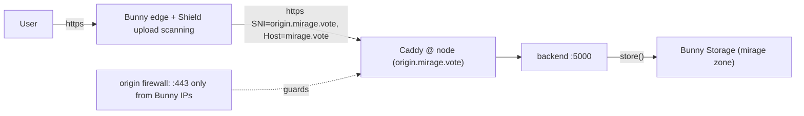

# Bunny edge cutover runbook

Per-node procedure to put a Mirage node behind the Bunny edge with Shield upload
scanning, so all uploads are scanned before they reach the origin and nobody can
bypass the scan by hitting the origin directly.

This is the operational runbook. The media-provider architecture doc it used to
accompany was removed on 2026-08-06; see git history if you need the background.

## Scope and end state

Two nodes run uploads, each behind its **own** Bunny edge, each writing to the
shared `mirage` storage zone. They are independent on purpose: if one edge is
down, the other still accepts uploads.

| Node | Public host | Uploads | Edge |
| --- | --- | --- | --- |
| vote | `mirage.vote` | `MEDIA_UPLOADS_ENABLED=true` | Bunny + Shield |
| talk | `mirage.talk` | `MEDIA_UPLOADS_ENABLED=true` | Bunny + Shield |
| n3 | `<val3>` | `MEDIA_UPLOADS_ENABLED=false` | none (direct) |
| n4 | `<val4>` | `MEDIA_UPLOADS_ENABLED=false` | none (direct) |

Do the nodes **one at a time**, `mirage.vote` first (lower traffic), then
`mirage.talk`. Each node is independently reversible.

`n3` / `n4` need no edge work — the `v1.29.0-media-uploads-enabled` migration
pins their `MEDIA_UPLOADS_ENABLED=false` automatically (no `DOMAIN` ->
not in the upload allowlist). Media uploaded on vote/talk still renders on them
because the `mirage-img` / `mirage-video` pull-zone URLs are global.



## How the pieces fit (why each step exists)

- **Shield upload scanning** runs at the Bunny edge on the upload request body, so
  it only protects uploads that actually pass through Bunny. Hence the origin
  firewall (below) and `MEDIA_UPLOADS_ENABLED=false` on non-edge nodes.
- **Real client IP**: behind a CDN, Caddy must be told which upstreams to trust and
  which header carries the real IP, or rate limiting and abuse logging see the CDN
  instead of the user. `EDGE_PROVIDER` drives `deploy/refresh_edge_ips.py`, which
  writes `/etc/caddy/trusted-proxies.caddy` (imported by the Caddyfile).
- **Origin TLS**: once `mirage.vote` DNS points at Bunny, Caddy can no longer renew
  the cert for `mirage.vote` via HTTP-01 (the challenge goes to Bunny). So we add an
  `origin.mirage.vote` subdomain that keeps pointing at the node IP; Caddy serves +
  renews a cert for it, and Bunny connects to the origin over that hostname.
- **Origin firewall** restricts `:443` to Bunny edge IPs so no one can reach the
  origin (and skip scanning) directly. `:80` stays open for ACME HTTP-01.

## Prerequisites (once)

- Bunny account with: Storage Zone `mirage`, pull zones `mirage-img` /
  `mirage-video`, Stream library, and `BUNNY_*` set in the node's
  `~/.mirage/env/secrets.env` (storage provider already working).
- DNS control for `mirage.vote` and `mirage.talk`.
- Bunny Shield available on the pull zone in front of the node.

## Per-node cutover

Replace `mirage.vote` / `origin.mirage.vote` with the node you are cutting over.

### 0. Pre-flight (no user impact)

On the node, confirm the new templates render and Caddy is happy BEFORE changing
anything live. This is the one mandatory safety check — a bad Caddyfile takes the
node down:

```bash
# inside the mirage container
DOMAIN=mirage.vote ORIGIN_DOMAIN=origin.mirage.vote LOGS_DIR=$HOME/.mirage/logs \
  python3 /opt/mirage/deploy/render_template.py \
  /opt/mirage/deploy/templates/caddy/Caddyfile /tmp/Caddyfile.test
EDGE_PROVIDER=both CADDY_DIR=/tmp python3 /opt/mirage/deploy/refresh_edge_ips.py
cp /tmp/trusted-proxies.caddy /tmp/   # ensure import target is next to the test file
caddy validate --config /tmp/Caddyfile.test --adapter caddyfile
```

`caddy validate` must pass (it has the `rate_limit` + `cloudflare` plugins in the
image). Do not proceed otherwise.

### 1. Origin subdomain DNS (do this first, while public DNS is unchanged)

Add an A record `origin.mirage.vote -> <node public IP>`. Leave the public
`mirage.vote` record pointing where it is for now. This lets Caddy get a TLS cert
for the origin hostname before any traffic moves.

### 2. Node env

Edit `~/.mirage/env/node.env`:

```
DOMAIN=mirage.vote
ORIGIN_DOMAIN=origin.mirage.vote
# "both" trusts Cloudflare AND Bunny so real client IP stays correct whether the
# node is still behind Cloudflare (pre-flip) or Bunny (post-flip). Switch to
# "bunny" only after Cloudflare is fully out of the path.
EDGE_PROVIDER=both
```

Edit `~/.mirage/env/backend.env`:

```
MEDIA_PROVIDER=bunny
MEDIA_UPLOADS_ENABLED=true
```

Restart the container (or re-render Caddy + reload). On start, the entrypoint
generates `/etc/caddy/trusted-proxies.caddy` and renders the Caddyfile with both
`mirage.vote` and `origin.mirage.vote` in the site address. Caddy obtains a cert
for `origin.mirage.vote` (and renews `mirage.vote` as usual, still direct).

> Existing domain nodes keep their old Caddyfile unless re-rendered. Force a
> re-render so the new `import trusted-proxies.caddy` + `ORIGIN_DOMAIN` take effect:
> remove the stale file and let the entrypoint regenerate it, or run
> `setup_letsencrypt.py --domain=mirage.vote` which always re-renders.

Verify the origin cert and origin reachability (still bypassing Bunny):

```bash
curl -sI https://origin.mirage.vote/api/get_node_config   # valid LE cert, 200
```

### 3. Bunny pull zone in front of the node

In the Bunny dashboard, on the pull zone that will serve `mirage.vote`:

- **Origin URL**: `https://origin.mirage.vote` (NOT the public host).
- **Verify Origin SSL**: ON (cert is valid, issued in step 2).
- **Forward Host Header**: ON — the backend needs the real public Host
  (`mirage.vote`) for host-based logic and for building absolute URLs. Caddy
  serves both names, so either way routes correctly.
- **Shield upload scanning**: ON, CSAM detection in **Block** mode (blocks and
  auto-reports on a positive match; this is not the WAF "log first" workflow).
  Set the request-body / scan size limit to cover our uploads
  (`MEDIA_MAX_VIDEO_MB`) and make unscannable-too-large uploads **fail closed**
  (block), not pass unscanned.
- **Edge rules**:
  - Bypass cache for `/api/*` and `/chain/*` (dynamic; origin also sends
    `Cache-Control: no-store` as defense in depth).
  - Enable WebSockets (for `/chain/rpc/websocket`).
  - Rate limit `/api/*` and `/chain/*` at the edge (origin keeps its own
    `rate_limit` as a fallback).

Test through Bunny BEFORE moving public DNS, using the pull-zone hostname (e.g.
`mirage-vote.b-cdn.net` or a temporary preview host) to confirm Bunny -> origin
works end to end (page loads, an upload is scanned, `/chain/rest` responds).

### 4. Flip public DNS

Point `mirage.vote` at Bunny (CNAME to the pull zone, per Bunny's instructions).
Wait for propagation. The site now serves through Bunny.

Verify:

```bash
curl -sI https://mirage.vote/ | grep -i server                       # Bunny/BunnyCDN
curl -sI https://mirage.vote/api/get_node_config | grep -i cache-control   # no-store
# Real client IP: check the access log shows real IPs, not Bunny edge IPs.
```

Also confirm uploads work (and a known-bad test is blocked by Shield), `/chain/*`
works, and WebSockets connect.

### 5. Lock the origin to Bunny

Once traffic flows through Bunny and is verified, restrict the origin so nobody can
reach it directly (and skip scanning). On the **host** (not the container), as root:

```bash
/opt/mirage/deploy/setup_origin_firewall.sh --apply     # :443 -> Bunny IPs only
/opt/mirage/deploy/setup_origin_firewall.sh --status
```

This installs an nftables allowlist for `:443` (coexists with UFW), keeps `:80`
open for ACME, leaves `22` / `26656` alone, and installs a daily timer that
refreshes the Bunny IP set. Confirm the site still loads through Bunny afterward.

> `origin.mirage.vote:443` is also now Bunny-only, which is fine — Bunny connects
> from its edge IPs. Cert renewal uses `:80` (HTTP-01), which stays open.

### 6. Retire Cloudflare for this node (later)

When Cloudflare is fully out of this node's path, set `EDGE_PROVIDER=bunny` in
`node.env` and restart so Caddy trusts only Bunny and reads `X-Real-IP`. (Keep the
`CLOUDFLARE_*` secrets only as long as the legacy `get_upload_url` shim must serve
old mobile builds.)

## Verification checklist (per node)

- [ ] `caddy validate` passed pre-flight.
- [ ] `https://origin.<domain>` serves a valid Let's Encrypt cert.
- [ ] Public host resolves to Bunny; pages load.
- [ ] Access log shows real client IPs (not Bunny edge IPs).
- [ ] `/api/*` and `/chain/*` responses carry `Cache-Control: no-store` and are not
      edge-cached.
- [ ] `curl -s https://<domain>/version` reports the deployed build. Bunny picks
      cache policy from the file extension and ignores the origin's `no-store`, so
      `/version.txt` is pinned at the edge for weeks; `/version` has no extension
      and reaches the origin.
- [ ] An upload succeeds and a known-bad sample is blocked by Shield.
- [ ] `/chain/rest` + `/chain/rpc` respond; `/chain/rpc/websocket` connects.
- [ ] `setup_origin_firewall.sh --status` shows the table + timer; direct origin
      `:443` from a non-Bunny IP is refused; site still loads via Bunny.

## Rollback

Each step reverses independently:

- **Firewall**: `setup_origin_firewall.sh --unlock` (reopens `:443` via UFW).
- **DNS**: point `mirage.vote` back at the node IP (or Cloudflare). Caddy already
  holds/renews the `mirage.vote` cert again once DNS is direct.
- **Edge env**: set `EDGE_PROVIDER=cloudflare` (or `both`) and restart.
- **Uploads**: set `MEDIA_UPLOADS_ENABLED=false` to immediately stop accepting
  uploads on a node while you investigate.

Storage is never migrated, so none of these touch existing media — reads keep
working throughout.

## Status — cutover complete (2026-06-28)

`mirage.vote` and `mirage.talk` are fully behind Bunny end to end:

- DNS for both domains is on **Bunny DNS** (`kiki.bunny.net` / `coco.bunny.net`);
  apex + `www` resolve to the pull zone, `origin.<domain>` -> node IP.
- Edge + Bunny Shield upload scanning (block mode) in front of both.
- `MEDIA_PROVIDER=bunny`, `MEDIA_UPLOADS_ENABLED=true`, `EDGE_PROVIDER=bunny`.
- Origin `:443` firewalled to Bunny edge IPs on both hosts (boot + daily timer).
- `n3` / `n4` keep `MEDIA_UPLOADS_ENABLED=false` (no scanning edge).

## To retire later (do NOT remove yet)

These are intentionally still in place to avoid breaking users on old app builds.
Removing any of them early breaks legacy mobile uploads.

- **Legacy `get_upload_url` shim** (`web/backend/routes/public.py`) — **hard deadline
  ~Aug 2026.** Returns the old Cloudflare browser-direct upload shape so pre-
  `/api/upload_media` app builds keep working. Gated on Cloudflare creds, not on
  `MEDIA_PROVIDER`. Loud per-call `logger.warning("DEPRECATED get_upload_url …")` —
  watch the logs; when callers drop to ~zero it is safe to delete.
- **`CLOUDFLARE_*` secrets** on `mirage.talk` (and `mirage.vote`) — keep ONLY while
  the shim must serve old builds. Deleting the creds alone disables the shim (it
  then returns `410 legacy_upload_unsupported`). Trigger: app builds using
  `/api/upload_media` dominate (shipped via EAS OTA).
- **Old Cloudflare DNS zones** for both domains — now dormant (NS point to Bunny).
  Safe to delete in the Cloudflare dashboard once NS propagation is confirmed
  stable. Purely housekeeping; no functional impact.

> Known temporary gap until the shim is gone: legacy mobile uploads go browser-
> direct to Cloudflare and therefore **bypass Bunny Shield CSAM scanning**. Only
> `/api/upload_media` (web + updated app) is scanned at the edge. This ends when
> the shim + Cloudflare creds are retired.
