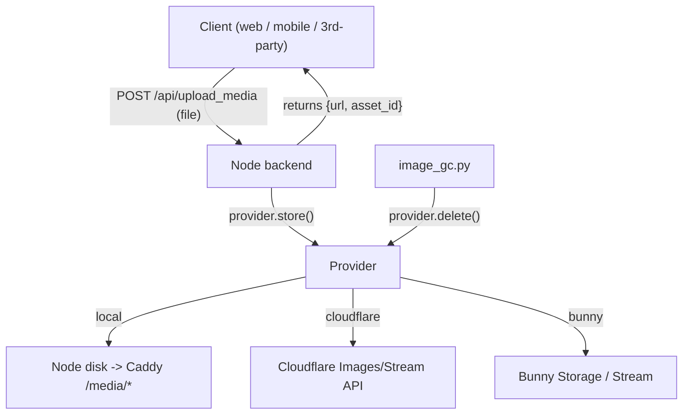

## Pluggable Media Providers

This document describes how Mirage nodes handle user-uploaded media (images and
videos) through a single, provider-agnostic upload contract, and how an operator
chooses where that media is stored.

### Principle: one uniform upload contract

Every node exposes exactly ONE upload mechanism. A client (web, mobile, or any
third-party) ALWAYS does the same thing, regardless of which storage backend the
node runs:

```
POST /api/upload_media        (multipart: kind=image|video, file=<bytes>)
  -> { "url": "...", "asset_id": "...", "kind": "image|video" }
```

There is no `mode` branching, no direct-to-vendor upload, no client-side resumable
upload, and no per-provider URL construction on the client. The client uploads the
file to the node and gets back a finished URL. All provider-specific work happens
server-side, hidden behind this one endpoint.

This is what lets the mobile app, the web frontend, and third-party clients work
identically against a `local`, `cloudflare`, or `bunny` node with zero client
knowledge of the backend.

### Storage providers (`MEDIA_PROVIDER`)

Storage is the one pluggable knob in the node. It is selected with the
`MEDIA_PROVIDER` env var and is completely hidden behind the uniform endpoint:

- `MEDIA_PROVIDER=local` (default for new nodes) — images/videos stored on the
  node's own disk and served by Caddy. No third-party account, runs instantly.
- `MEDIA_PROVIDER=cloudflare` — the backend uploads to Cloudflare Images/Stream
  server-side (via the Cloudflare API, not browser-direct) and serves
  `imagedelivery.net` / `videodelivery.net` URLs.
- `MEDIA_PROVIDER=bunny` — the backend uploads to Bunny Storage (AccessKey) and
  Bunny Stream; an Optimizer-enabled pull zone is used for delivery.

`local`, `cloudflare`, and `bunny` are simply the first entries in a provider
registry. The design is provider-agnostic: no vendor name appears outside its own
provider class and its env var block. Adding any future provider (S3, Backblaze
B2, GCS, Cloudinary, imgix, Mux, ...) is one subclass plus one registry entry —
see "Adding a new provider" below.

### Video resolution policy (applies to all providers)

Video is gated on duration and resolution at upload time, uniformly across
providers, to keep delivery costs bounded while still allowing crisp short clips:

- Clips `<=60s` (short): allow high resolution, up to 4K. Short clips are cheap to
  deliver regardless of resolution (small byte size), so there is no reason to
  restrict them.
- Clips `>60s` (long-form): capped at 1080p. This keeps long-form under the
  per-GB delivery cost crossover and avoids the expensive "long + 4K" case.
- An absolute max duration (`MEDIA_VIDEO_MAX_DURATION_SEC`) applies on top.

Enforcement is driven by the generic `provider.transcodes` capability flag, never
by hardcoded vendor names:

- `transcodes == True` (e.g. bunny, cloudflare, a future Mux-like provider):
  downscale long videos to 1080p via the encoding ladder (full ladder up to 2160p
  for short clips, capped at 1080p for long-form).
- `transcodes == False` (e.g. local, a future plain object-store provider):
  REJECT a `>60s` upload above 1080p with a clear error. Bundling an ffmpeg
  transcode pipeline into a self-hoster contradicts the "runs instantly, minimal
  deps" goal, so non-transcoding providers enforce by validation rather than
  downscaling.

### Video posters / thumbnails (client guidance — read this for mobile)

When a video upload returns, `url` is the playable stream (an HLS playlist for
transcoding providers), e.g. Bunny `https://{host}/{guid}/playlist.m3u8`. A still
poster is derived from that URL, and the path differs per provider:

- Bunny Stream:     `https://{host}/{guid}/thumbnail.jpg`  (note: NO `thumbnails/`)
- Cloudflare Stream: `https://{host}/{uid}/thumbnails/thumbnail.jpg`

**CRITICAL timing caveat.** The provider generates that server-side thumbnail
during transcoding, which is NOT instant — Bunny Stream returns **HTTP 404** for
`/{guid}/thumbnail.jpg` until processing finishes (seconds to minutes). A client
that fetches the poster immediately after upload and never retries will show a
permanently blank tile, even after the video is ready (the failed ``/request
is never retried). This is the single most common "video preview is blank" bug.

Two correct ways to handle it:

1. **Instant local poster (recommended for the composer / just-uploaded preview).**
   The uploader already has the source file, so capture the first frame on the
   client and show THAT immediately — zero dependence on the provider finishing.
   - Web: `captureVideoPoster()` in `web/frontend/src/utils/media.js` decodes the
     file into a hidden `<video>`, draws a frame to a canvas, and registers the
     resulting object URL against the returned video URL so every preview
     (`getVideoThumbnailUrl`) uses it instantly.
   - Mobile: do the equivalent with the platform thumbnailer on the local file you
     just uploaded — iOS `AVAssetImageGenerator`, Android `MediaMetadataRetriever`,
     or `expo-video-thumbnails` — and show that until the post is published.
2. **Server thumbnail with retry.** If you must use the server poster (e.g. an
   existing post in the feed where there is no local file), that is fine: by the
   time a post is viewed the video is already processed. Only for the brief
   just-uploaded window, retry the poster on error (with a cache-busting query)
   until it loads instead of giving up on the first 404.

For already-published posts (feed / detail views) the server thumbnail is the
right source and is reliably available — no special handling needed.

### Architecture

The client is uniform; storage is a pluggable knob hidden behind the one endpoint.



### Provider interface (`web/backend/media/`)

A small base class `MediaProvider` with implementations `LocalProvider`,
`CloudflareProvider`, and `BunnyProvider`, plus a `get_media_provider()` factory
selected by `MEDIA_PROVIDER`. The interface is the ONLY contract; the backend,
endpoint, GC, and frontend never name a specific vendor. The uniform
`/api/upload_media` endpoint calls `store()`; the client never sees the provider.

Members:

- `id: str` — stable provider key stored in `image_catalog.provider`.
- `transcodes: bool` — capability flag that drives the video resolution policy
  generically (downscale long-form when `True`, reject when `False`), so the
  policy is not hardcoded to specific vendors.
- `store(kind, stream, content_type, duration, height) -> {"url","asset_id"}` —
  receives bytes server-side and writes them (local disk write / vendor API
  upload). The core method; all providers implement it.
- `delivery_url(asset_id, variant)` — build the public URL.
- `delete(asset_id) -> bool` — the clean "easy delete" used by garbage collection.
- `owns_url(url)` / `asset_id_from_url(url)` — URL parsing for validation and GC.

Genericity rules (so this is truly pluggable, not vendor-shaped):

- A `PROVIDER_REGISTRY` maps `id -> class`. The factory and URL detection both
  iterate the registry. URL detection (validation, GC, frontend `media.js`)
  consults `owns_url` across ALL registered providers, not just the active one, so
  dual-read works for ANY past or future provider — not a hardcoded Cloudflare
  special-case.
- Cloudflare's legacy hosts are just `CloudflareProvider.owns_url`; "legacy" is not
  a separate code path, it is the registry doing its job.
- No vendor name appears outside its own provider class plus its env var block.

Notes:

- `CloudflareProvider.store()` uses Cloudflare's server-side upload API
  (`POST /images/v1`, `/stream`), NOT browser-direct. This is what lets the
  Cloudflare provider sit behind the same uniform endpoint.
- For video, transcoding providers (`bunny`, `cloudflare`) apply the resolution
  policy via the encoding ladder; non-transcoding providers (`local`) reject
  long-form above 1080p instead.

### Adding a new provider (the extension point)

A future provider (e.g. S3, Backblaze B2, GCS, Cloudinary, Mux) must satisfy this
checklist — nothing outside it changes:

1. Add `XProvider(MediaProvider)` in `web/backend/media/` implementing
   `store/delivery_url/delete/owns_url/asset_id_from_url` and setting `id` +
   `transcodes`.
2. Register it in `PROVIDER_REGISTRY` so the factory and URL detection pick it up.
3. Add its env var block to `secrets.env` / `backend.env`.

The uniform endpoint, video policy (via `transcodes`), GC (via `delete`), URL
detection (via the registry), and all clients work unchanged. Bunny and Cloudflare
are simply the first two non-local entries in this registry.

### Local provider — serving and storage

- Store under a persistent dir (e.g. `~/.mirage/media/{images,videos}/yyyy/mm/{uuid}.{ext}`)
  on the already-persisted node volume.
- Caddy serves it: a `handle /media/*` -> `file_server` block with a long
  immutable cache, `X-Content-Type-Options: nosniff`, and a forced safe
  `Content-Type` / `Content-Disposition` (never serve SVG/HTML inline). An upload
  body-size cap is applied on `/api/upload_media`.
- Video: store the raw mp4 and serve it directly; no transcoding/HLS.
  `InlineMedia` already renders direct video by extension. Per the video resolution
  policy, local accepts short clips (`<=60s`) at any resolution but REJECTS
  long-form (`>60s`) above 1080p (no ffmpeg on the node to downscale); long-form
  1080p clips are stored raw and served directly.

### Upload safety scanning (edge-only, not in the node)

Upload safety scanning is NOT part of the node. There is no node-side scanner and
no scanner env var. When required, scanning is an operator/edge concern, enabled
via DNS/edge configuration in front of the upload path — it is not coupled to the
node code path. Bunny Shield is the reference/recommended implementation (scanning
uploads at the edge before the origin), but the architecture does not depend on
Bunny specifically: any edge that fronts the upload path can perform the scan.

Two consequences follow, and both are stated plainly so operators are never
surprised:

- A node that does not front its uploads through the edge has no upload safety
  scanning.
- This cannot be a bundled node default: the relevant known-hash safety databases
  are access-gated and cannot be shipped inside open-source software, so scanning
  can only ever be an operator/edge concern.

#### `MEDIA_UPLOADS_ENABLED` — fail-closed upload gate

Because scanning lives at the edge, a node that is NOT behind a scanning edge
must not accept public uploads at all. That is enforced by a single backend flag
`MEDIA_UPLOADS_ENABLED` (`backend.env`):

- `true` — the node accepts uploads. Only set this where a scanning edge fronts
  the upload path (Bunny Shield upload scanning).
- `false` — both `POST /api/upload_media` and the legacy `POST /api/get_upload_url`
  return `403 uploads_disabled`. Media already stored elsewhere still renders
  (reads are unaffected); only new uploads to this node are refused.

The default is `true` for fresh installs (preserves prior behavior), but the
per-node migration `v1.29.0-media-uploads-enabled` pins it explicitly on existing
nodes: `true` only on the domains that run a scanning edge
(`mirage.vote`, `mirage.talk`) and `false` on every other node (e.g. the IP-only
nodes). This is the same per-node gatekeeper pattern as `OPEN_BROWSING_ENABLED`.

#### Mirage's deployment: two independent scanning edges

Mirage runs uploads on two independent nodes, each behind its own Bunny edge with
Shield upload scanning, each writing to the shared `mirage` storage zone:

- `mirage.vote` and `mirage.talk`: `MEDIA_UPLOADS_ENABLED=true`, behind Bunny.
- `n3` / `n4` (IP-only): `MEDIA_UPLOADS_ENABLED=false`. They never accept uploads,
  so they need no scanning edge. Media uploaded on vote/talk still renders on them
  (the `mirage-img` / `mirage-video` pull-zone URLs are global).

They are deliberately independent (no central upload node): if one edge is down,
the other still accepts uploads. The full per-node procedure (DNS, Bunny Shield,
client-IP, origin firewall, origin TLS) lives in
[bunny_cutover_runbook.md](bunny_cutover_runbook.md).

### Garbage collection (the "easy delete")

- `scripts/image_gc.py` calls `provider.delete(asset_key)` instead of a
  vendor-specific delete, picking the provider from `MEDIA_PROVIDER`. This works
  for local (unlink), bunny (Storage DELETE), cloudflare (Images API), and any
  future provider via its `delete()`. View tracking is unchanged; the periodic
  invocation in `deploy/entrypoint.sh` stays.
- `image_catalog` carries a `provider` column so multi-provider asset keys do not
  collide.

### Legacy `get_upload_url` shim — STRICTLY TEMPORARY

Older mobile builds expect the old browser-direct Cloudflare upload flow. To avoid
breaking them during the dual-provider cutover on mirage.talk, the legacy
`get_upload_url` endpoint is kept as a thin backward-compatible shim that returns
the old Cloudflare direct-upload shape.

Smooth cutover (the important part): the shim is gated on **Cloudflare credentials
being present**, NOT on the node's active `MEDIA_PROVIDER`. This is what makes the
switch seamless — a node can set `MEDIA_PROVIDER=bunny` for all NEW uploads while
old mobile builds keep uploading to Cloudflare through `get_upload_url`, because
the Cloudflare creds are still configured. Both paths coexist:

- New clients (web + updated app) → `POST /api/upload_media` → bunny.
- Old mobile builds → `POST /api/get_upload_url` → Cloudflare (unchanged).

Honest tradeoff: because old-app uploads still go browser-direct to Cloudflare,
they bypass any edge upload-safety scan (e.g. Bunny Shield) until the app moves to
`/api/upload_media`. This is the unavoidable cost of not breaking old builds, and
it ends when the shim is retired.

This shim is temporary and MUST be removed after ~August 2026. To make that
impossible to forget, the implementation:

- Wraps the handler in an unmissable removal banner at the top and bottom, e.g.
  `# ===== DEPRECATED LEGACY SHIM - REMOVE AFTER 2026-08 - DO NOT BUILD ON THIS =====`
- Emits a `logger.warning("DEPRECATED get_upload_url called - remove after 2026-08")`
  on every call, so any lingering old-app callers are visible in logs and you can
  tell exactly when it is safe to delete.

Once OTA-updated app versions dominate, delete the shim and retire mirage.talk's
Cloudflare credentials (removing the creds alone is enough to disable the shim —
it then returns `410 legacy_upload_unsupported`). The app-side switch to
`/api/upload_media` (shipped via EAS OTA) is tracked separately; the node only
guarantees backward compatibility so the app is never the thing that breaks.

### Recommended Bunny cutover (zero app breakage)

Storage and edge are separate steps. Switching `MEDIA_PROVIDER=bunny` only changes
where new bytes are stored; it does NOT put scanning in front of uploads. Fronting
a node with the Bunny scanning edge (and the client-IP / firewall / TLS that go
with it) is the full cutover, documented step-by-step in
[bunny_cutover_runbook.md](bunny_cutover_runbook.md). The short version:

1. Create the Bunny resources and set `BUNNY_*` in `~/.mirage/env/secrets.env`.
2. Set `MEDIA_PROVIDER=bunny` in `~/.mirage/env/backend.env`. New uploads now go
   server-side into Bunny Storage / Stream.
3. Put the node behind Bunny with Shield upload scanning, set `EDGE_PROVIDER=bunny`
   and `MEDIA_UPLOADS_ENABLED=true`, point DNS at Bunny, and lock the origin to
   Bunny IPs — see the runbook.
4. KEEP the existing `CLOUDFLARE_*` credentials in place. This is what keeps the
   legacy `get_upload_url` shim alive for old mobile builds.

Result: new web + updated-app uploads go into Bunny (scanned at the edge); old
mobile builds keep uploading to Cloudflare via the shim; all previously stored
Cloudflare media keeps rendering (dual-read). When old app versions die out, drop
the `CLOUDFLARE_*` creds and delete the shim.

### Configuration

Backend env (`deploy/templates/env/backend.env`):

- `MEDIA_PROVIDER=local` (default)
- `MEDIA_UPLOADS_ENABLED=true` — fail-closed upload gate; set `false` on any node
  not behind a scanning edge (see "Upload safety scanning" above).
- `MEDIA_LOCAL_DIR`, `MEDIA_PUBLIC_BASE_URL`
- `MEDIA_MAX_IMAGE_MB`, `MEDIA_MAX_VIDEO_MB`
- Video policy: `MEDIA_SHORT_CLIP_SEC=60`, `MEDIA_LONGFORM_MAX_HEIGHT=1080`,
  `MEDIA_VIDEO_MAX_DURATION_SEC`

Edge / node env (`deploy/templates/env/node.env`) — only relevant when a node is
fronted by a CDN edge:

- `EDGE_PROVIDER=cloudflare|bunny|both` — which edge sits in front of the node, so
  Caddy derives the real client IP correctly. `deploy/refresh_edge_ips.py` turns
  this into `/etc/caddy/trusted-proxies.caddy` at startup.
- `ORIGIN_DOMAIN` — origin hostname Bunny connects to (e.g. `origin.mirage.vote`),
  kept pointing at the server IP so Caddy can renew TLS via HTTP-01 after the
  public domain moves to Bunny.

Secrets env (`deploy/templates/env/secrets.env`), all optional and
provider-specific:

- Cloudflare: `CLOUDFLARE_*` (kept for the cloudflare provider and legacy shim)
- Bunny: `BUNNY_STORAGE_ZONE`, `BUNNY_STORAGE_ACCESS_KEY`, `BUNNY_PULL_ZONE_HOST`,
  `BUNNY_STREAM_LIBRARY_ID`, `BUNNY_STREAM_API_KEY`

### Key decisions and honest tradeoffs

- The uniform client contract is the top priority: every node exposes one
  `POST /api/upload_media` -> `{url}`, and the client never knows the provider.
  This is what keeps web, mobile, and third-party clients working identically
  against any node.
- Tradeoff of uniformity: the endpoint is server-proxied, so upload bytes transit
  the node for `local`/`cloudflare`/`bunny`. For downscaled images, short clips,
  and 1080p-capped long-form this is acceptable. If keeping bytes off the node ever
  becomes necessary, fronting the upload path with an edge handler is a future
  optimization that does not change the client contract.
- Storage (`MEDIA_PROVIDER`) is the only pluggable knob in the node. Bunny is ONE
  option, never a hard dependency.
- Genericity by construction: a `PROVIDER_REGISTRY` plus the `transcodes`
  capability flag means no vendor name appears outside its own provider class and
  env block. Adding S3/B2/GCS/Cloudinary/Mux is one subclass plus one registry
  entry; video policy, GC, URL detection, and clients stay vendor-agnostic.
- Video resolution policy bounds delivery cost: high-res (up to 4K) for `<=60s`
  clips (cheap because short); `>60s` capped at 1080p. Transcoding providers
  downscale via the encoding ladder; non-transcoding providers (local) reject
  `>60s` above 1080p.
- Upload safety scanning is deliberately NOT in the node: it is an edge concern
  (enabled via DNS), inherent to an edge-offload deployment. Bunny Shield is the
  reference implementation, but the architecture is not Bunny-specific — any
  scanning edge works. A node not fronted by a scanning edge has no scanning,
  stated plainly above.
- Existing Cloudflare-hosted media keeps working everywhere (dual-read). There is
  no data migration.
- The `get_upload_url` shim is STRICTLY temporary with a hard ~August 2026 removal
  deadline, enforced in code via a loud banner and a per-call deprecation warning.
