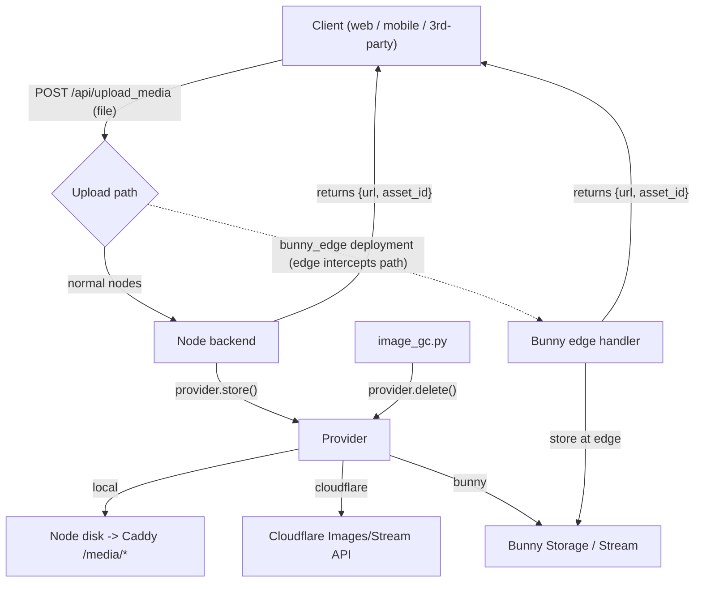

## Pluggable Media Providers

This document describes how Mirage nodes handle user-uploaded media (images and
videos) through a single, provider-agnostic upload contract, and how an operator
chooses where that media is stored.

### Principle: one uniform upload contract

Every node exposes exactly ONE upload mechanism. A client (web, mobile, or any
third-party) ALWAYS does the same thing, regardless of which storage backend the
node runs:

```
POST /api/upload_media        (multipart: kind=image|video, file=<bytes>)
  -> { "url": "...", "asset_id": "...", "kind": "image|video" }
```

There is no `mode` branching, no direct-to-vendor upload, no client-side resumable
upload, and no per-provider URL construction on the client. The client uploads the
file to the node and gets back a finished URL. All provider-specific work happens
server-side, hidden behind this one endpoint.

This is what lets the mobile app, the web frontend, and third-party clients work
identically against a `local`, `cloudflare`, or `bunny` node with zero client
knowledge of the backend.

### Storage providers (`MEDIA_PROVIDER`)

Storage is the one pluggable knob in the node. It is selected with the
`MEDIA_PROVIDER` env var and is completely hidden behind the uniform endpoint:

- `MEDIA_PROVIDER=local` (default for new nodes) — images/videos stored on the
  node's own disk and served by Caddy. No third-party account, runs instantly.
- `MEDIA_PROVIDER=cloudflare` — the backend uploads to Cloudflare Images/Stream
  server-side (via the Cloudflare API, not browser-direct) and serves
  `imagedelivery.net` / `videodelivery.net` URLs.
- `MEDIA_PROVIDER=bunny` — the backend uploads to Bunny Storage (AccessKey) and
  Bunny Stream; an Optimizer-enabled pull zone is used for delivery.

`bunny_edge` is not a client-visible mode. It is an operator deployment in which
the same `/api/upload_media` path is intercepted by a Bunny edge handler before
the origin is touched. Bytes never reach the node; the client still just POSTs to
`/api/upload_media`. This is achieved via DNS/edge config and is transparent to
both the client and the node application.

### Architecture

The client is uniform; storage is a pluggable knob hidden behind the one endpoint.
The `bunny_edge` deployment swaps the origin handler for an edge handler without
changing the client contract.



### Provider interface (`web/backend/media/`)

A small base class `MediaProvider` with implementations `LocalProvider`,
`CloudflareProvider`, and `BunnyProvider`, plus a `get_media_provider()` factory
selected by `MEDIA_PROVIDER`. The uniform `/api/upload_media` endpoint calls
`store()`; the client never sees the provider.

- `store(kind, stream, content_type) -> {"url","asset_id"}` — receives bytes
  server-side and writes them to the backend (local disk write / Cloudflare
  Images|Stream API upload / Bunny Storage|Stream API upload). This is the core
  method; all providers implement it.
- `delivery_url(asset_id, variant)` — build the public URL.
- `delete(asset_id) -> bool` — the clean "easy delete" used by garbage collection.
- `owns_url(url)` / `asset_id_from_url(url)` — URL parsing for validation and GC,
  including legacy Cloudflare hosts.

Notes:

- `CloudflareProvider.store()` uses Cloudflare's server-side upload API
  (`POST /images/v1`, `/stream`), NOT browser-direct. This is what lets the
  Cloudflare provider sit behind the same uniform endpoint.
- `bunny_edge` is not a provider class — it is an operator edge deployment that
  intercepts `/api/upload_media` at the Bunny edge and performs the equivalent of
  `BunnyProvider.store()` there, returning `{url, asset_id}` so the origin is
  never touched. The node still records the asset for GC via a small edge->node
  callback. A reference edge handler lives in `deploy/bunny-edge/`.

### Local provider — serving and storage

- Store under a persistent dir (e.g. `~/.mirage/media/{images,videos}/yyyy/mm/{uuid}.{ext}`)
  on the already-persisted node volume.
- Caddy serves it: a `handle /media/*` -> `file_server` block with a long
  immutable cache, `X-Content-Type-Options: nosniff`, and a forced safe
  `Content-Type` / `Content-Disposition` (never serve SVG/HTML inline). An upload
  body-size cap is applied on `/api/upload_media`.
- Video: store the raw <=60s mp4 (already duration-capped client-side) and serve
  it directly; no transcoding/HLS. `InlineMedia` already renders direct video by
  extension.

### Upload safety scanning (edge-only, not in the node)

Upload safety scanning is NOT part of the node. There is no node-side scanner and
no scanner env var. When required, scanning is handled entirely at the edge by
Bunny Shield, which is enabled purely via DNS/Bunny configuration and is inherent
to the `bunny_edge` deployment (uploads are scanned at Bunny's edge before reaching
the origin).

Two consequences follow, and both are stated plainly so operators are never
surprised:

- A node that does not front its uploads through the edge has no upload safety
  scanning.
- This cannot be a bundled node default: the relevant known-hash safety databases
  are access-gated and cannot be shipped inside open-source software, so scanning
  can only ever be an operator/edge concern.

For mirage.talk, the canonical option for scanning is to front uploads through the
edge (`bunny_edge`).

### Garbage collection (the "easy delete")

- `scripts/image_gc.py` calls `provider.delete(asset_key)` instead of a
  vendor-specific delete, picking the provider from `MEDIA_PROVIDER`. This works
  for local (unlink), bunny (Storage DELETE), and cloudflare (Images API). View
  tracking is unchanged; the periodic invocation in `deploy/entrypoint.sh` stays.
- `image_catalog` carries a `provider` column so multi-provider asset keys do not
  collide.

### Legacy `get_upload_url` shim — STRICTLY TEMPORARY

Older mobile builds expect the old browser-direct Cloudflare upload flow. To avoid
breaking them during the dual-provider cutover on mirage.talk, the legacy
`get_upload_url` endpoint is kept as a thin backward-compatible shim that returns
the old Cloudflare direct-upload shape — ONLY when the client lacks the new-upload
capability flag and the provider is `cloudflare`.

This shim is temporary and MUST be removed after ~August 2026. To make that
impossible to forget, the implementation:

- Wraps the handler in an unmissable removal banner at the top and bottom, e.g.
  `# ===== DEPRECATED LEGACY SHIM - REMOVE AFTER 2026-08 - DO NOT BUILD ON THIS =====`
- Emits a `logger.warning("DEPRECATED get_upload_url called - remove after 2026-08")`
  on every call, so any lingering old-app callers are visible in logs and you can
  tell exactly when it is safe to delete.

Once OTA-updated app versions dominate, delete the shim and retire mirage.talk's
Cloudflare credentials. The app-side switch to `/api/upload_media` (shipped via
EAS OTA) is tracked separately; the node only guarantees backward compatibility so
the app is never the thing that breaks.

### Configuration

Backend env (`deploy/templates/env/backend.env`):

- `MEDIA_PROVIDER=local` (default)
- `MEDIA_LOCAL_DIR`, `MEDIA_PUBLIC_BASE_URL`
- `MEDIA_MAX_IMAGE_MB`, `MEDIA_MAX_VIDEO_MB`

Secrets env (`deploy/templates/env/secrets.env`), all optional and
provider-specific:

- Cloudflare: `CLOUDFLARE_*` (kept for the cloudflare provider and legacy shim)
- Bunny: `BUNNY_STORAGE_ZONE`, `BUNNY_STORAGE_ACCESS_KEY`, `BUNNY_PULL_ZONE_HOST`,
  `BUNNY_STREAM_LIBRARY_ID`, `BUNNY_STREAM_API_KEY`
- `bunny_edge` deployment: `BUNNY_EDGE_CALLBACK_SECRET` (shared HMAC so the edge
  handler can authenticate its asset-registration callback to the node)

### Key decisions and honest tradeoffs

- The uniform client contract is the top priority: every node exposes one
  `POST /api/upload_media` -> `{url}`, and the client never knows the provider.
  This is what keeps web, mobile, and third-party clients working identically
  against any node.
- Tradeoff of uniformity: the endpoint is server-proxied, so upload bytes transit
  the node for `local`/`cloudflare`/`bunny`. For 60s-capped videos and downscaled
  images this is acceptable. `bunny_edge` is the escape hatch that keeps bytes off
  the node, transparently at the edge, without changing the client contract.
- Storage (`MEDIA_PROVIDER`) is the only pluggable knob in the node. Bunny is ONE
  option, never a hard dependency.
- Upload safety scanning is deliberately NOT in the node: it is an edge concern
  (enabled via DNS), inherent to the `bunny_edge` deployment. A node not fronted by
  the edge has no scanning, stated plainly above.
- Existing Cloudflare-hosted media keeps working everywhere (dual-read). There is
  no data migration.
- The `get_upload_url` shim is STRICTLY temporary with a hard ~August 2026 removal
  deadline, enforced in code via a loud banner and a per-call deprecation warning.
